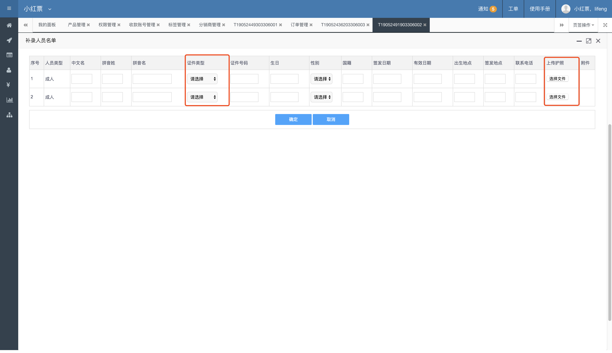
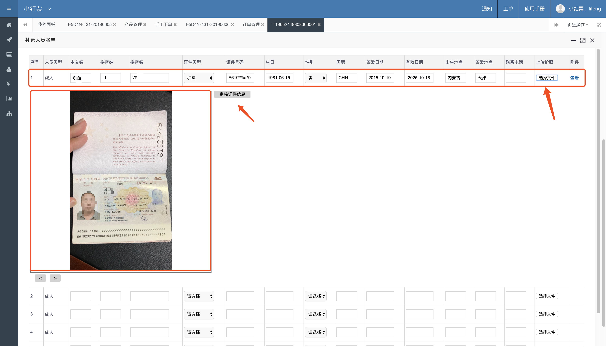
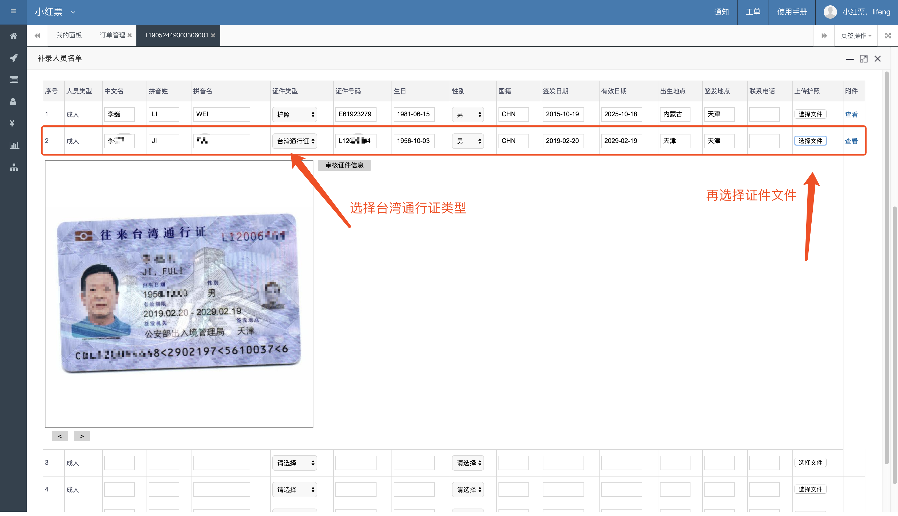

# 录入人员名单信息

人员信息可以手工填写，也可以通过上上传证件方式进行识别

## 护照识别 

选择证件后，系统会自动进行护照的内容识别，证件信息会自动填充进来，下方会显示证件图片，点击`审核证件信息`按钮后，当前证件信息才有效

这是为了预防证件信息错误，所以需要人工进行一次二次确认。

护照识别的准确率高达98%

​

## 台湾通行证识别 

新版台湾通行证可以正常识别（卡片式）

首先需要将旅客的证件类型更改为`台湾通行证`，然后上传证件图片，系统会自动填充证件信息。

证件信息也需要二次审核确认才可以保存。

