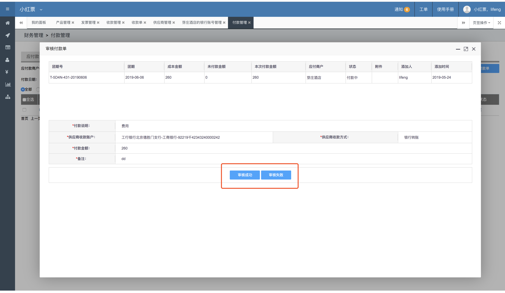

# 付款管理

付款管理包括所有我们需要向供应商付款的记录

大部分付款记录都产生于团期管理的团期成本中，不指定团期的，也可以手动添加付款记录

### 提交付款申请

收款的供应商，需要提交维护好收款账号，以便进行选择

付款时，针对一个付款记录，可以分配付款，比如1000块的单据，可以一次付600，一次付400

### 待审核

待审核界面中，需要主管人员进行付款申请的审核，判断此次付款申请是否合理，审批同意后，会进入财务付款流程，如何审批拒绝，则可以重新提交申请

### 待付款

业务人员付款成功后，会进入待付款界面，点击付款单号，会看到如下图所示

可以看到成本金额、未付款金额、已付款金额  
收款方名称、银行账号、收款方式和备注信息  
财务人员可以自行录入本次付款金额

需要上传付款凭证，也就是给对方转账的截图


如果付款单金额过大，我们需要分批付款，比如100万，先付30万，再付50万，再付20万。


### 付款成功

